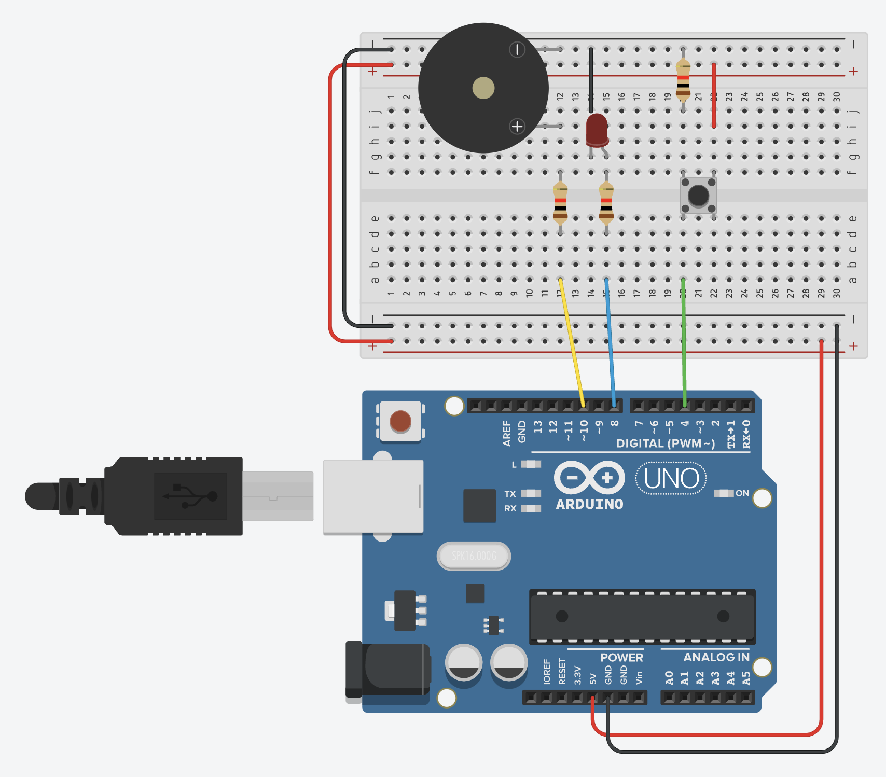
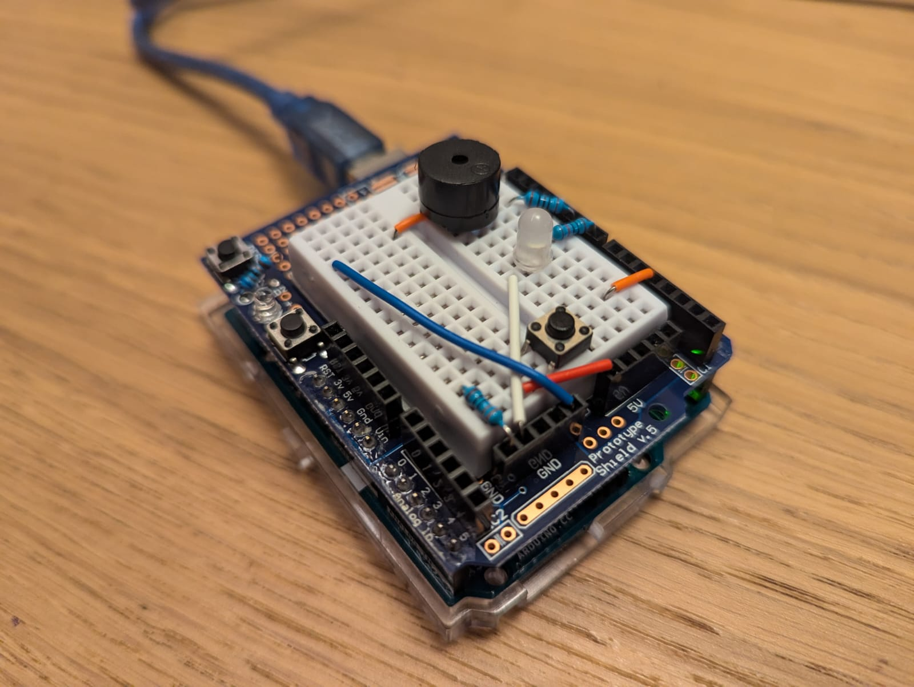

# MorseDuino

Watch a video of the prototype making [sweet music](./assets/beep-beep.mp4).

## What is?

Code and circuit diagram to create a simple morse code clacker.

## Why is?

So I can communicate with my friend in Canada with Morse code (that is the actual reason).

## What next?

At the moment it's just the light and piezo buzzer, but the next step is to connect it to the Wide Web of the World, and get it to buzz a similar device on the other side of the planet!

## Can you help?

...please?
